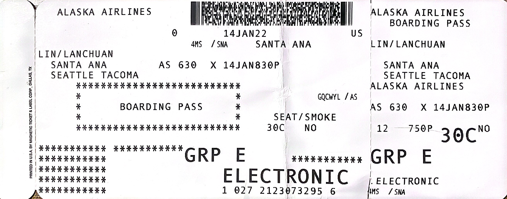
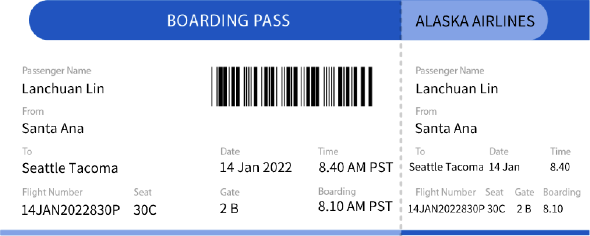
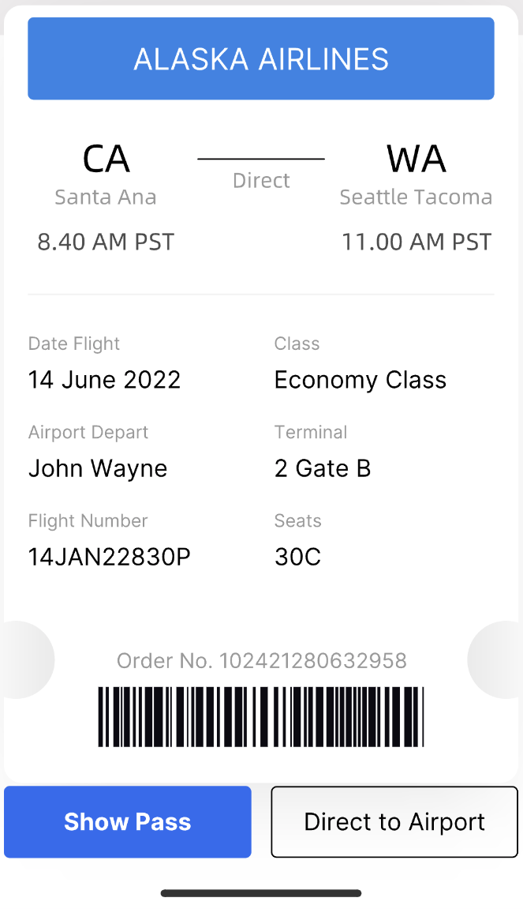

## Boarding Pass Analysis

### Current boarding pass analysis

This is my Alaska airline boarding pass. Let's look at it. 

Some potential problems in Alaska airline boarding pass.

- Hierarchy: The information provided is a bit messy and irregular, and it is difficult to rely on logic to find the approximate location of the information
- Importance: Some field information is missing, so that passengers can only identify the meaning of the field through the information
- Relative prioritization: The font size of relatively unimportant information is too large, which affects the reading of normal information

### Information architecture elements of the new boarding pass

In order to define the information architecture of the new boarding pass, I want to show my Guidelines.

1. Formatting the information, and dividing and displaying the information according to the usage scenarios. For example, getting boarding passes, finding gates, pre-flight, etc
2. Prioritize showing some important information, easy to user experience.

### Print/Kiosk version

For this version, the user is part of people who is older, which means they are not good at using Mobile. So they prefer to print boarding passes with help of an employee of the airport or use a Kiosk machine to print boarding passes by themselves.

- Hierarchy: Arrange the information in a neat layout and clearly separate the customer and employee parts, which can make the boarding pass tidier
- Importance: Adding fields before some important information, such as gate, check-in time, seat number, etc., makes the learning curve less steep for first-time flight attendants
- Relative prioritization: Remove unnecessary images so that customers can find the information they are looking for at first glance. At the same time, the relevant information is grouped into one piece according to the user scenario, such as the check-in port, the check-in time, and flight number, which belong to the pre-boarding scenario. The seat number and departure time belong to the post-registration scenario

#### Benefits

User perspective: 

1. Reducing user concerns, users do not need to worry about air tickets themselves, they only need to arrive at the counter or consult the relevant staff, which is very convenient
2. Improving user experience, A paper boarding pass can bring a sense of ceremony to customers who are flying for the first time

Business perspective: 

1. Improving company reputation, Airlines can take this opportunity to increase brand awareness and recognition, showcase corporate services, and increase users' trust and sense of belonging to the company

### Mobile version

The user of these people is relatively younger, they can view their boarding pass anytime, anywhere with internet access and don't need to worry about losing their boarding pass.

- Hierarchy: Compared with the traditional horizontal layout, here I choose the vertical layout, in order to cater to the browsing habits of users' mobile phones
- Importance: The same as the Print/Kiosk version, the corresponding fields will be added to the information for easy reading
- Relative prioritization: First show a simplified version, which only has the departure place, destination, check-in time, arrival time, check-in gate, flight number, and seat number. Also provides a button on the e-ticket to the full version, which provides all the information about the flight

#### Benefits

User perspective: 

1. Incorporating different versions of boarding passes imporves user experience
2. Having a boarding pass on a mobile phone, will not be lost or damaged, and the record will be permanently available
3. Switching between different languages, users can choose the language they are familiar with

Business perspective: 

1. Reducing employee stress and corporate ticket printing and management expenses
2. Increasing corporate revenue, different from the paper version, the electronic version of the boarding pass, the airline can release more flexibly and adjust some advertising strategies

